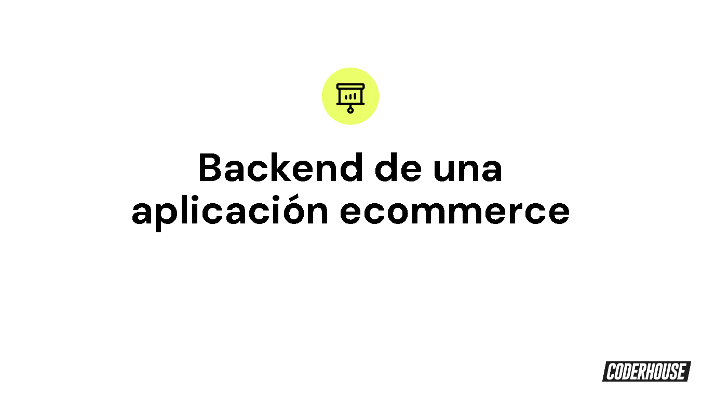

<h1 style="text-align: center; color: orange;"> Proyecto Final Curso BackEnd</h1>
<h2 style="text-align: center;"> Ultima Entrega Aplicación eCommerce</h2>

### https://pfbackend-production-4fb8.up.railway.app/users

<h3 style="text-align: justify;">La aplicación esta diseñada para desplegar la API
por medio de Handlebars usando res.render en lugar de
de res.send, esto para fines didacticos, además despliega
diferentes opciones según el Roll del usuario.</h3>

<h4> PARA PROBAR DEBE CREAR USUARIOS CON DIFERENTES ROLES PARA VER
LOS CAMBIOS, ADEMAS DE USAR UN CORREO VALIDO PARA PODER RECIBIR Y ENVIAR EMAILS.</h4>

# RONNIE ALVAREZ CASTRO

### http://localhost:3033/
